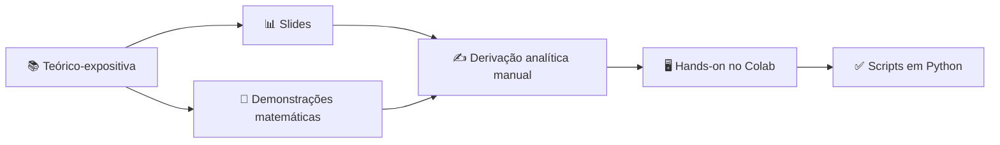

# Introdução a Redes Neurais Densas (DNNs) em Python

### 🎓 Minicurso: Introdução a Redes Neurais Densas (DNNs) em Python

---

## 🧮 Pré-requisitos Obrigatórios

| Área | Requisitos |
|:----:|:-----------|
| 🧠 **Matemática** | Cálculo Diferencial (Cálculo II + Vetorial) • Álgebra Linear |
| 💻 **Programação** | Lógica • Python básico • Google Colab |

> [!IMPORTANT]
> Para um melhor aproveitamento do conteúdo, é **essencial** que o participante possua conhecimentos sólidos nas áreas acima.

---

## 📖 Resumo

<table>
<tr>
<td>

🚀 Este minicurso propõe uma **jornada introdutória** ao universo da **Inteligência Artificial**, partindo das bases conceituais até a implementação de modelos computacionais modernos.

🎯 O foco central reside nas **Redes Neurais Densas (Deep Neural Networks - DNNs)** , estruturas fundamentais que servem de base para o **aprendizado profundo (Deep Learning)** .

</td>
</tr>
</table>

### A abordagem será dividida em duas frentes:

| 🔬 Fundamentação Teórica | 💻 Etapa Aplicada |
|:-----------------------:|:-----------------:|
| Modelagem matemática e probabilística dos neurônios artificiais | Utilização das principais bibliotecas do ecossistema Python |
| Derivação analítica dos cálculos fundamentais | Construção e treinamento de modelos próprios |

---

## 🎯 Objetivos de Aprendizagem

Ao final do minicurso, o aluno será capaz de:

| # | Objetivo |
|:-:|:----------|
| 1️⃣ | Compreender a **evolução histórica e técnica** da IA até as Redes Neurais |
| 2️⃣ | Entender a **arquitetura de uma DNN** (camadas, funções de ativação e pesos) |
| 3️⃣ | Dominar o fluxo de treinamento: **feedforward e backpropagation** |
| 4️⃣ | **Implementar modelos** de redes densas em ambiente Google Colab |
| 5️⃣ | Utilizar pacotes essenciais (**Keras/TensorFlow**) para regressão e classificação |

---

## 🔬 Metodologia

  

> [!TIP]
> Um diferencial da abordagem será a etapa de **derivação analítica**, na qual os alunos realizarão manualmente alguns dos cálculos fundamentais de uma rede neural (como o passo de atualização de pesos), consolidando o aprendizado teórico **antes** da transição para a oficina prática.

---

## 🛠️ Ferramentas Utilizadas

| Ferramenta | Ícone | Finalidade |
|:----------:|:-----:|:-----------|
| **Google Colab** |  | Ambiente de notebooks na nuvem |
| **Python** | 🐍 | Linguagem principal |
| **TensorFlow/Keras** | 🔥 | Construção de DNNs |
| **NumPy** | 🔢 | Computação numérica |
| **Matplotlib** | 📊 | Visualização de dados |

## 👨‍🏫 Instrutor

Desenvolvido para a oficina prática do minicurso **"Introdução a Redes Neurais Densas (DNNs) em Python"**.

---

  
### 🔜 Em breve: notebooks práticos no Google Colab!

**[⭐ Deixe uma estrela neste repositório para receber atualizações!]**

